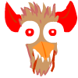

# Ultimate Chicken Revenge 6
Game Jam for 2015/01/18

Ultimate Chicken Revenge or WAFAGTIAAAAC (What A Fuckingly Awesome Game This Is Awesomely Addictive And About Chicken).

2D-two-player-game were you should follow the rule... or not.

Game Jam theme was lie.

## Rules
- There are two chicken craving to be with its eggs.
- The two chickens are rival and only the first one will have the 5 shiny points rewarding him to be the first one to be with its eggs.
- Control keys are: WSAD for red chicken and IKJL for blue chicken. Too bad if you are not in qwerty :S.
- The board in the top let you know what is the forbidden direction for each round. You can play only when the rule is set.
- The color of the arrow in the board apply to the color of the player.
- You must respect the instruction but if you see the evil chicken. In this case the rule concerns the opposite direction.
- This is the evil chicken: 
- The level is cyclic, so you can go down to the bottom to move to the top (e.g. if moving up is forbidden).

## Tips
- Diagonal moves are faster!
